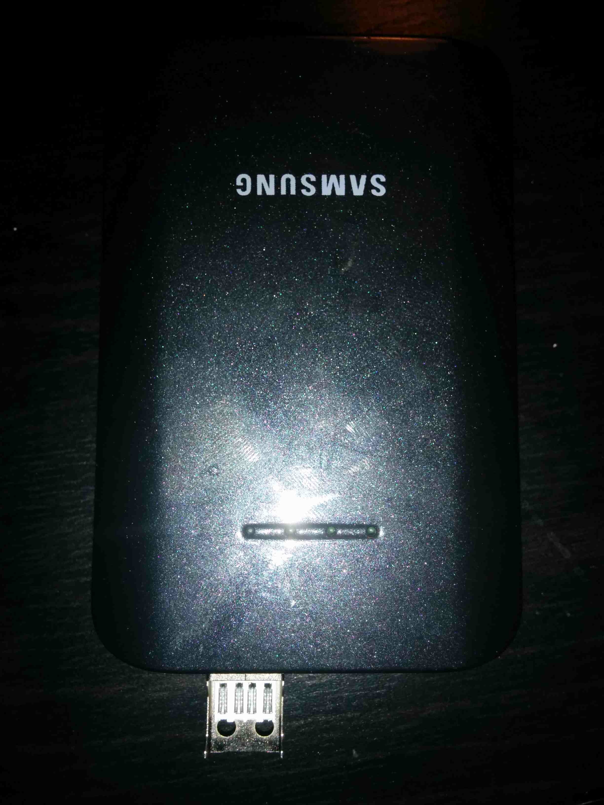
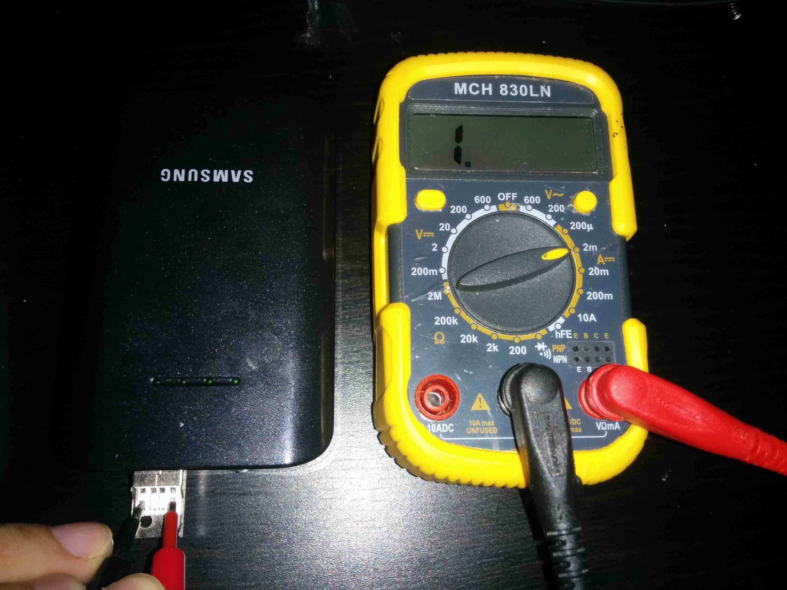
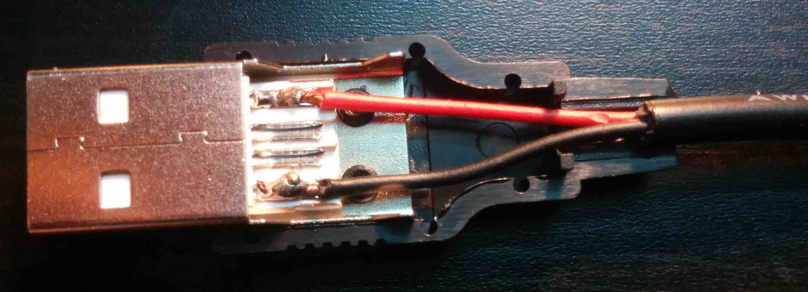

## Power

This document deals with the four methods of powering the beaglebone, these being: external PSU, power over USB, power over ethernet and battery power.

- NOTE: consolidate and link to Fredrik's project: https://github.com/redFrik/udk10-Embedded_Systems/tree/master/udk131219#--extra-power-consumption

### Using an External Power Supply
- beaglebone uses a 5v 2A
- advisable as provides enough amps

### Power Over USB
- is possible but not advisable as USB doesn't typically provide enough amps to reliably read and write to the SD card reader

### Power Over Ethernet
- in some projects which use ethernet anyway, PoE would help in reducing cabling/complexity
- PoE is specified by IEEE 802.3-2005
- basic explanation:
"Power over Ethernet or PoE describes any of several standardized or ad-hoc systems which pass electrical power along with data on Ethernet cabling. This allows a single cable to provide both data connection and electrical power to devices such as wireless access points or IP cameras. Unlike standards such as Universal Serial Bus which also power devices over the data cables, PoE allows long cable lengths. Power may be carried on the same conductors as the data, or it may be carried on dedicated conductors in the same cable."
- from: http://www.thegeekstuff.com/2009/01/overview-of-poe-power-over-ethernet-concepts-and-devices-list/
- more details here: http://www.connect802.com/ethernet.htm
- use with Arduino here: http://www.freetronics.com/pages/power-over-ethernet-for-arduino

- There are two basic options for providing the power:

#### 1. PoE enabled switch
- switch acts as a power source
- costs at least £25

#### 2. Midspan
- power injector is injected by a device inserted between the switch and the beagle
- midspans seem to make no sense if a separate power adapter is needed for each one (is this the case?)
- midspans cost?
- a cheap but dodgy solution is to hack up and power an ethernet cable

### Battery Power

In general, there are two options when it comes to powering the Beaglebone Black using batteries. The first is to provide power via the 5v barrel DC jack input - as we would when using a DC power supply - whilst the second is to do so via the dedicated power management chip on the Beaglebone itself. The advantage of the latter approach is that this chip can do fancy things like handling recharging of the battery (when a mains power supply is connected). However, the major downside is that the USB port does not receive power, which is essential for running a USB soundcard. For this reason, the 'barrel jack approach' is the preferred method for most applications.

#### Powering the Beaglebone's DC Barrel Jack Using a 'Power Bank'

Portable 'Power Banks' are commonly used in China for extending the life of mobile devices whilst on-the-go, and prove to be an excellent option for powering the Beaglebone Black. This is because:

* They typically have a 5V2A output (for tablets) - precisely the 
* They are available in a compact form-factor which matches the dimensions of the Beaglebone Black itself
* They contain circuitry for handling reliable of lithium-ion

##### Power Bank Overview

Almost all the available Power Banks use li-ion 18650 batteries, where the voltage output is stepped up from the standard 3.7v to the required 5v and the number of cells determines the overall capacity. Some cursory research on Chinese e-commerce website [Taobao](http://www.taobao.com) reveals a number of different types of Power Bank that are suitable for powering the Beaglebone Black. In addition some types contain a removable battery cover(http://a.m.taobao.com/i35081419154.htm), whilst others can [handle multiple voltages](http://a.m.taobao.com/i13062921497.htm) (not just 5v). The following are a 

#### [DIY Build](http://a.m.taobao.com/i35540106206.htm)
* This one you can buy the power bank parts
* This is a good candidate for making a diy battery shield (see images)

#### [Single battery](http://a.m.taobao.com/i36546498972.htm)
* This is commonly referred to under the name 'ML102'
* The 2014 version has a micro USB input for charging
* For supplying power, a standard A USB output is used
* Current is limited, but the description suggests it could supply 1200mA output (enough?)

#### [Dual Battery](http://a.m.taobao.com/i20085144001.htm)
* This is a compact and solid option, with 2A output

#### [Triple Battery](?):

* This is good size match for beaglebone:
- beagle is 86.40×53.3mm
- this bank is 75x75x22mm

##### Measuring the Output of the Power Bank

Before connecting the Power Bank to our precious Beaglebone we can use a multimeter to measure its actual output in terms of both voltage and current. Typically the connections inside a typical USB port are difficult to accesss. However, a simple way to overcome this is to connect a [male 'Standard A' USB connector] to the port and measure from the newly exposed points.

[This image](http://www.pinout.ca/wp-content/themes/directorypress/thumbs/USB_A_pinout1.jpg) shows the pinouts of a male 'Standard A' USB cable, while the process of - is shown in the image below:

As it turns out, this power bank isn't so useful for our purposes, as it only provides 1A output (presumably such a small bank is only geared-up to power mobile phones).

#### Making up a Cable

Once satisfied with the power output, the next step is to make up a very short male Standard A USB to DC 5.5mm x 2.1mm barrel jack cable for connecting the Power Bank to our Beaglebone Black. The process is shown below:

Soldering the USB Standard A connections:

Soldering the DC Barrel Jack connections (Don't forget to thread the barrel jack sleeve onto the cable before soldering!):

The finished cable in use looks like this:

#### Real World Testing: How long can three batteries last?

### Powering the Beaglebone via the Onboard TPS65217C Power Management Chip

report that 5V via tp5 does not work with a thermistor soldered.l between tp7 and tp8:
https://groups.google.com/forum/m/#!msg/beagleboard/TYYoGbcnGO0/oLLtgCXHaUEJ

usb tutorial below successfully powers the BBB from battery via the 5v barrel jack input. Other users report stability problems this way...
http://archlinuxarm.org/forum/viewtopic.php?f=28&t=5505

** Overview

TPS65217C and 

- beaglebone uses the TPS65217C for power management
- link to datasheet:
- can be used to run from and to charge a battery
- a common way to power the beaglebone is via a single cell lion or lipo battery (typically 3.7v)
- this will power the beagle itself, but not the USB port
- the problem is that the USB host port design assumes that 5V is being supplied to the board…
- …but there is nothing there to generate 5V from the battery input
- battery capes are available, may be useful to study their design e.g. : http://circuitco.com/support/index.php?title=BeagleBone_Battery
- but does it provide power to the USB host port?
- one thread suggests: "A good solution to this is to use an external battery pack designed for Smartphones. I use www.powerocks.com - These charge from a standard USB charger (5v) and also produce 5v output on USB sockets. So just plug the Beaglebone into the battery pack using the supplied USB cable. This will power the Beaglebone USB host socket enabling the WiFi dongle. However I do not know if the USB input on the Beaglebone limits current draw to 500mA - If so, you may need to make a special cable to feed the power into the dedicated power socket instead. WiFi dongles are quite power hungry."

AIM: to power the beagle and its USB port via battery, in a compact form

TI TPS65217C handles power management and is programmable. The IC also contains built-in battery charging capability.

BBB can be run from 3.7V
but for USB we need to
- use one cell and step-up to 5V
or
- run dual cells and step-down to 5V

If the main supply gets disconnected, the battery immediately takes over.

Lithium Ion (Li-Ion)
Lithium Polymer (Li-Po)
preferably w/ built-in protection circuit. 

1400mah lasts 2h50m / charges in about 2 hours

tp5 bat - battery connection point
tp6 sense - battery voltage sense input
tp7 ts - temp sense input
tp8 gnd - system ground

Capes:
These capes support powering the USB port

http://andicelabs.com/beaglebone-powerbar/
http://andicelabs.com/beaglebone-powercape/

### Futher Reading
- basic guide: http://pansenti.wordpress.com/2013/06/01/powering-a-beaglebone-black-with-a-single-cell-li-ion-or-lipo-battery-yes-it-can-be-done-but-there-are-issues/
- follow up hack (not advisable): http://pansenti.wordpress.com/2013/06/01/battery-powered-beaglebone-black-and-the-usb-host-port-works-too/
- discussion: https://groups.google.com/forum/#!topic/beagleboard/6hQ7voyk_Xw
- beaglebone battery tutorial here: http://www.element14.com/community/community/knode/single-board_computers/next-gen_beaglebone/blog/tags/bbb

Non USB tutorial - great info here:
http://www.element14.com/community/community/knode/single-board_computers/next-gen_beaglebone/blog/2013/08/10/bbb--rechargeable-on-board-battery-system

Another tutorial here based on similar approach:
http://www.beaglebone-asterisk.org/uninterruptible-power-supply-ups-for-beaglebone-black-a-diy-project/

Tutorial with USB here (not compact but works):
http://insigntech.wordpress.com/2013/09/10/power-bbb-on-car-battery-12vdc/
a 12v battery is stepped down to 5v, which powers both the beagle (5v jack in) and a powered usb hub. The hub runs from the beagles usb port and hosts two usb devices

Fredrik's approach here (see orfi_twitter section):
https://github.com/redFrik/udk10-Embedded_Systems/blob/master/udk131219/README.md

Sparkfun LiPo advice:
https://www.sparkfun.com/tutorials/241

